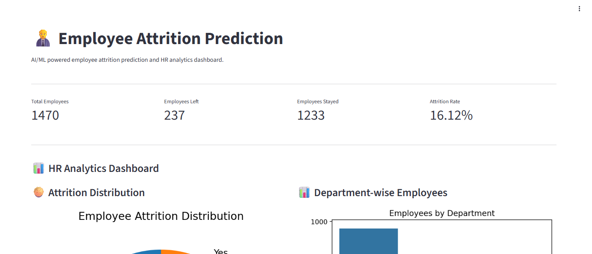
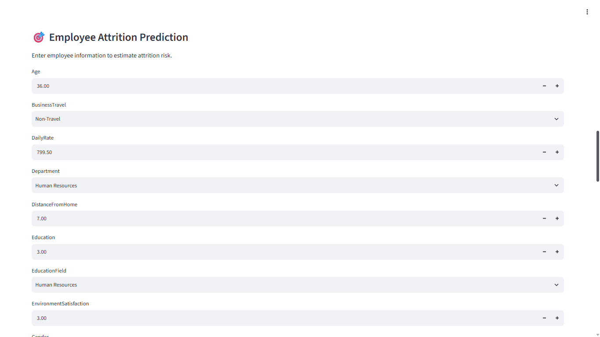

# Employee Attrition Prediction & HR Analytics

An end-to-end Machine Learning project that predicts employee attrition risk and provides an interactive HR analytics dashboard using Streamlit.

## Project Overview

Employee attrition can affect workforce stability, hiring costs, productivity, and employee planning.

This project uses Machine Learning to estimate whether an employee is likely to leave the organization based on factors such as:

- Job role
- Monthly income
- Overtime
- Job satisfaction
- Age
- Distance from home
- Years at company
- Work-life balance
- Job level
- Business travel
- And other employee-related attributes

The project also includes an interactive Streamlit dashboard for HR analytics and employee-level prediction.

> Note: The dataset used in this project is the IBM HR Analytics Employee Attrition dataset, which is a fictional dataset created for analytics and machine learning purposes.

---

## Key Features

- Data cleaning and preprocessing
- Exploratory Data Analysis (EDA)
- Attrition distribution analysis
- Department-wise employee analysis
- Overtime vs attrition analysis
- Categorical feature encoding
- Numerical feature scaling
- Machine Learning model training
- Logistic Regression
- Random Forest
- Gradient Boosting
- Model evaluation
- Attrition probability prediction
- Interactive Streamlit dashboard
- Employee-level risk prediction

---

## Machine Learning Workflow

```text
Raw Dataset
     ↓
Data Cleaning
     ↓
Exploratory Data Analysis
     ↓
Feature Preparation
     ↓
Train/Test Split
     ↓
Preprocessing Pipeline
     ↓
Model Training
     ↓
Model Evaluation
     ↓
Random Forest Model
     ↓
Model Serialization
     ↓
Streamlit Dashboard

## Screenshots

### Dashboard


### Department Analysis


### Overtime vs Attrition


### Prediction Input


### HR Analytics Dashboard


